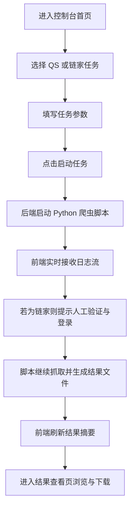

## 1. 产品概述
为现有 `qs_rank.py` 与 `lianjia.py` 提供一个桌面优先的可视化交互前端，统一完成爬虫任务配置、启动、运行监控、结果预览与文件下载。
- 解决当前只能通过命令行运行脚本、难以观察进度、难以区分公开数据与登录增强数据的问题。
- 面向课程实验演示与日常调试场景，提升可操作性、展示效果与结果可追踪性。

## 2. 核心功能

### 2.1 用户角色
本系统为单机本地实验工具，无需区分多角色用户。

### 2.2 功能模块
1. **控制台首页**：项目概览、爬虫入口、运行状态总览、最近结果摘要。
2. **任务执行页**：选择 QS 或链家任务，配置参数，启动/停止任务，查看实时日志。
3. **结果查看页**：展示 QS 排名结果、链家公开结果、链家登录增强结果，并支持文件下载与目录跳转提示。

### 2.3 页面详情
| 页面名称 | 模块名称 | 功能描述 |
|-----------|-------------|---------------------|
| 控制台首页 | 顶部概览卡片 | 展示项目名称、当前 Python 环境提示、最近运行时间、结果文件数量 |
| 控制台首页 | 爬虫快捷入口 | 提供“运行 QS”“运行链家”“查看结果”快捷按钮 |
| 控制台首页 | 最近结果面板 | 展示 `QSRank.txt`、`Lianjia.xls`、`Lianjia_Public.xls`、`Lianjia_Login.xls` 的最近更新时间 |
| 任务执行页 | 任务选择区 | 在 QS 排名抓取、链家房源抓取之间切换 |
| 任务执行页 | 参数表单 | 配置浏览器类型、目标抓取数量、详情页数量、是否等待人工登录等参数 |
| 任务执行页 | 状态控制栏 | 启动任务、停止任务、清空日志、打开结果目录 |
| 任务执行页 | 实时日志区 | 按时间流式显示后端返回的日志，区分信息、警告、错误状态 |
| 任务执行页 | 会话提示卡 | 对链家任务展示“需先人工验证并登录”“Cookie 已恢复”“检测到验证码暂停”等提示 |
| 结果查看页 | QS 结果表格 | 展示学校名称、排名、分数、城市、国家、Logo 下载状态 |
| 结果查看页 | 链家公开结果表格 | 展示小区名、户型、面积、朝向、楼层、总价、单价 |
| 结果查看页 | 链家增强结果表格 | 展示脱敏姓名、电话密文、HMAC，并提示这些字段依赖登录后详情抓取 |
| 结果查看页 | 文件下载区 | 下载 `QSRank.txt`、`Lianjia.xls`、`Lianjia_Public.xls`、`Lianjia_Login.xls` |

## 3. 核心流程
用户先进入控制台首页，选择需要运行的爬虫任务。进入任务执行页后，填写参数并启动任务。后端调用本地 Python 脚本执行抓取，并将标准输出以日志流方式实时推送到前端。任务结束后，前端自动刷新结果摘要，并在结果查看页中展示最新文件内容与下载入口。对于链家任务，系统优先提示用户在浏览器中手动完成验证与登录，再继续自动抓取。

## 4. 用户界面设计
### 4.1 设计风格
- 主色：深墨蓝 `#0F172A`，强调色使用青蓝 `#22D3EE` 与暖橙 `#FB923C`
- 按钮风格：圆角中等、半透明高光边框、悬浮有轻微抬升与阴影反馈
- 字体：标题使用 `Noto Serif SC`，正文使用 `Noto Sans SC`
- 布局风格：桌面优先的控制台布局，左侧导航 + 右侧内容区 + 卡片式信息分组
- 图标风格：使用线性图标，强调技术控制台与运行态视觉
- 氛围细节：深色渐变背景、细网格纹理、日志区域使用终端风格配色，强调“实验控制台”质感

### 4.2 页面设计概览
| 页面名称 | 模块名称 | UI 元素 |
|-----------|-------------|-------------|
| 控制台首页 | 顶部概览卡片 | 大号统计数字、柔和发光边框、状态标签、渐变背景 |
| 控制台首页 | 爬虫快捷入口 | 大尺寸操作按钮、图标、说明文案、悬浮动画 |
| 任务执行页 | 参数表单 | 分组表单、切换开关、数字输入框、单选按钮、说明提示 |
| 任务执行页 | 实时日志区 | 深色终端面板、彩色日志级别标记、自动滚动、空态插画 |
| 任务执行页 | 状态控制栏 | 主操作按钮、次级操作按钮、进度状态点、当前任务徽标 |
| 结果查看页 | 数据表格 | 固定表头、列宽优化、空值占位符、筛选标签、滚动容器 |
| 结果查看页 | 文件下载区 | 文件卡片、更新时间、下载按钮、生成路径说明 |

### 4.3 响应式设计
- 采用桌面优先设计，针对 `1280px` 以上宽度优化演示效果
- 在平板宽度下收缩为顶部导航 + 单列卡片布局
- 移动端仅保证基础浏览，不作为主要使用场景

