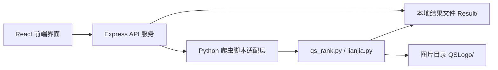
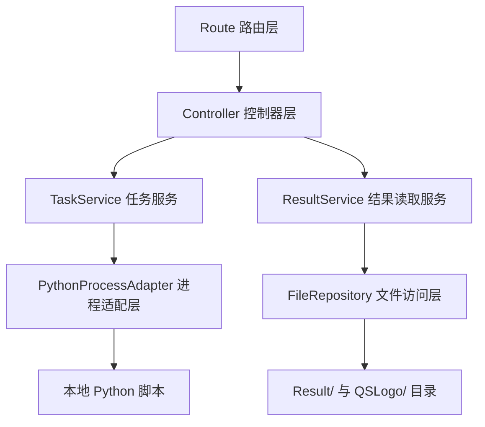
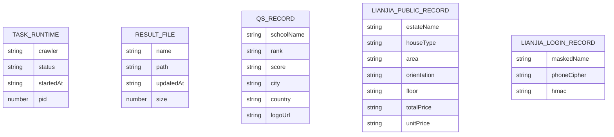

## 1. 架构设计


## 2. 技术说明
- 前端：React 18 + TypeScript + Vite + Tailwind CSS + Zustand
- 后端：Express + TypeScript
- 初始化工具：`vite-init`
- 进程集成：Node.js `child_process.spawn` 启动 Python 脚本
- 数据读取：后端解析 `Result/` 目录下的 `.txt`、`.xlsx`、`.xls` 文件并转换为接口数据
- 日志推送：前后端使用 Server-Sent Events（SSE）实时推送任务日志
- 文件下载：后端提供静态文件下载接口

## 3. 路由定义
| 路由 | 用途 |
|-------|---------|
| / | 控制台首页，展示概览和快捷入口 |
| /tasks | 任务执行页，配置并运行爬虫任务 |
| /results | 结果查看页，浏览与下载抓取结果 |

## 4. API 定义
### 4.1 类型定义
```ts
export type CrawlerType = 'qs' | 'lianjia'

export interface RunTaskRequest {
  crawler: CrawlerType
  browser?: 'edge' | 'chrome'
  targetCount?: number
  maxDetailPages?: number
  disableManualVerify?: boolean
  skipLoginWait?: boolean
}

export interface TaskStatusResponse {
  running: boolean
  crawler: CrawlerType | null
  startedAt: string | null
  pid: number | null
}

export interface ResultFileItem {
  name: string
  path: string
  updatedAt: string
  size: number
}
```

### 4.2 接口列表
| 方法 | 路径 | 用途 |
|------|------|------|
| GET | /api/overview | 获取首页概览与最近结果摘要 |
| POST | /api/tasks/run | 启动指定爬虫任务 |
| POST | /api/tasks/stop | 停止当前运行任务 |
| GET | /api/tasks/status | 获取当前任务运行状态 |
| GET | /api/tasks/log-stream | 通过 SSE 订阅实时日志 |
| GET | /api/results/qs | 读取并返回 QS 结果数据 |
| GET | /api/results/lianjia/public | 读取链家公开结果数据 |
| GET | /api/results/lianjia/login | 读取链家登录增强结果数据 |
| GET | /api/files | 获取结果文件列表 |
| GET | /api/files/download | 下载指定结果文件 |

### 4.3 请求与响应示例
```ts
// POST /api/tasks/run
{
  "crawler": "lianjia",
  "browser": "edge",
  "targetCount": 100,
  "maxDetailPages": 30,
  "disableManualVerify": false,
  "skipLoginWait": false
}
```

```ts
// GET /api/overview
{
  "latestTask": "lianjia",
  "running": false,
  "resultFiles": [
    {
      "name": "Lianjia.xls",
      "path": "Result/Lianjia.xls",
      "updatedAt": "2026-07-21 16:17:39",
      "size": 24576
    }
  ]
}
```

## 5. 服务端架构图


## 6. 数据模型
### 6.1 数据模型定义


### 6.2 数据定义说明
- 本项目不引入独立数据库，运行态数据保存在内存中，结果数据直接读取本地文件
- `TASK_RUNTIME` 仅表示后端进程运行状态，不持久化到数据库
- `QS_RECORD` 来源于 `Result/QSRank.txt`
- `LIANJIA_PUBLIC_RECORD` 来源于 `Result/Lianjia_Public.xls` 或对应 `.xlsx`
- `LIANJIA_LOGIN_RECORD` 来源于 `Result/Lianjia_Login.xls` 或对应 `.xlsx`
- 若课程演示需要更强的断点恢复能力，可后续扩展为 SQLite 持久化，但当前版本优先保持与现有 Python 项目最小改动集成

